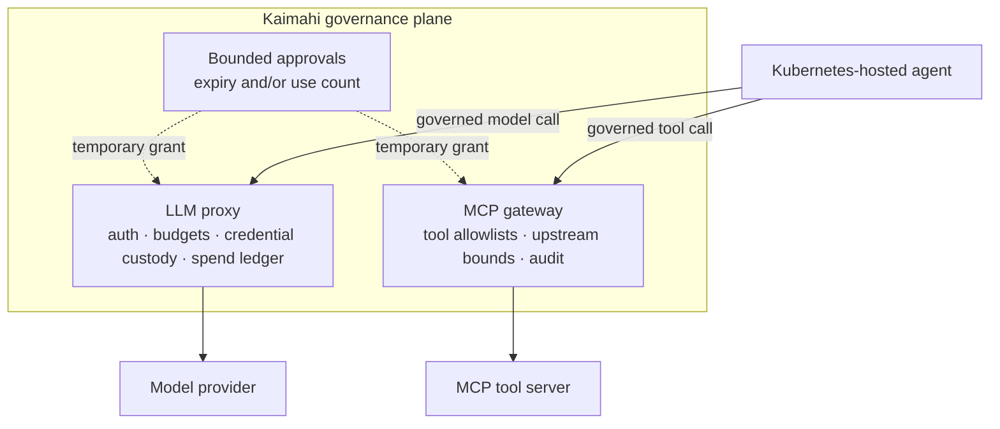

# Kaimahi Brand Assets Implementation Plan

> **For agentic workers:** REQUIRED SUB-SKILL: Use superpowers:subagent-driven-development (recommended) or superpowers:executing-plans to implement this plan task-by-task. Steps use checkbox (`- [ ]`) syntax for tracking.

**Goal:** Create the canonical Kaimahi mascot, compact mark, wordmark, README hero, GitHub social preview, and precise architecture diagram.

**Architecture:** The main `kaimahi` repository owns canonical sources under `brand/`; the organization profile references them by absolute GitHub URL. A standard-library validator checks dimensions, alpha requirements, and SVG metadata in CI. Generative artwork establishes the mascot and illustration system; code-authored SVG remains responsible for the compact mark, wordmark, and technical architecture.

**Tech Stack:** OpenAI ImageGen, SVG, Mermaid CLI for one-time SVG rendering, Python 3 standard library, ImageMagick for deterministic sizing/cropping, GitHub Actions.

**Spec:** `docs/superpowers/specs/2026-09-01-organization-and-brand-design.md`

## Global Constraints

- The mascot is an original night worker: capable, protective, and slightly magical; not chibi and not cute for cuteness's sake.
- Do not use pointed ears, Christmas cues, franchise silhouettes, or Māori-inspired ornamentation.
- Palette: deep navy, moonlit blue/teal, warm lantern amber, and soft off-white.
- Product line: `Governance for AI agents running on Kubernetes.`
- Preserve explicit incubation status and do not imply production readiness.
- Architecture claims must match the current capability docs and distinguish governed from ungoverned paths.
- Canonical outputs live in `brand/`; precise technical art lives in `docs/assets/`.
- Do not add `GOVERNANCE.md` or `CODE_OF_CONDUCT.md`.

---

## File map

| File | Responsibility |
|---|---|
| `brand/mascot.png` | Transparent high-resolution master character |
| `brand/mark.svg` | Small-size compact night-worker/crescent/lantern mark |
| `brand/mark.png` | GitHub-ready square raster export |
| `brand/wordmark.svg` | Horizontal Kaimahi wordmark plus optional compact product line lockup |
| `brand/hero.png` | Wide README and organization-profile illustration |
| `brand/social-preview.png` | Exact 1280×640 GitHub preview composition |
| `brand/README.md` | Meaning, palette, usage, dimensions, and provenance |
| `docs/assets/architecture.mmd` | Editable technical diagram source |
| `docs/assets/architecture.svg` | Rendered README diagram |
| `scripts/check-brand-assets.py` | Dependency-free structural asset validation |
| `.github/workflows/ci.yml` | Runs asset validation in the existing hygiene job |

### Task 1: Add a failing brand-asset validator

**Files:**
- Create: `scripts/check-brand-assets.py`
- Modify: `.github/workflows/ci.yml`
- Test: `scripts/check-brand-assets.py`

**Interfaces:**
- Consumes: the exact file map above.
- Produces: exit status `0` only when required assets have valid dimensions and SVG metadata.

- [ ] **Step 1: Create the validator before any asset exists**

Create `scripts/check-brand-assets.py` with this complete implementation:

```python
#!/usr/bin/env python3
from __future__ import annotations

import struct
import sys
import xml.etree.ElementTree as ET
from pathlib import Path

ROOT = Path(__file__).resolve().parents[1]

PNG_REQUIREMENTS = {
    "brand/mascot.png": (1536, 1536, True),
    "brand/mark.png": (1024, 1024, True),
    "brand/hero.png": (1600, 600, False),
    "brand/social-preview.png": (1280, 640, False),
}

SVG_REQUIREMENTS = {
    "brand/mark.svg": "Kaimahi compact mark",
    "brand/wordmark.svg": "Kaimahi wordmark",
    "docs/assets/architecture.svg": "Kaimahi governance architecture",
}


def png_metadata(path: Path) -> tuple[int, int, bool]:
    data = path.read_bytes()
    if data[:8] != b"\x89PNG\r\n\x1a\n" or data[12:16] != b"IHDR":
        raise ValueError("not a PNG with an IHDR header")
    width, height, _depth, color_type = struct.unpack(">IIBB", data[16:26])
    return width, height, color_type in {4, 6}


def validate_png(relative: str, expected: tuple[int, int, bool]) -> list[str]:
    path = ROOT / relative
    if not path.is_file():
        return [f"{relative}: missing"]
    try:
        actual = png_metadata(path)
    except (OSError, ValueError, struct.error) as error:
        return [f"{relative}: {error}"]
    width, height, must_have_alpha = expected
    problems = []
    if actual[:2] != (width, height):
        problems.append(f"{relative}: dimensions {actual[:2]} != {(width, height)}")
    if must_have_alpha and not actual[2]:
        problems.append(f"{relative}: alpha channel required")
    return problems


def validate_svg(relative: str, expected_title: str) -> list[str]:
    path = ROOT / relative
    if not path.is_file():
        return [f"{relative}: missing"]
    try:
        root = ET.parse(path).getroot()
    except (OSError, ET.ParseError) as error:
        return [f"{relative}: invalid XML: {error}"]
    problems = []
    if not root.tag.endswith("svg"):
        problems.append(f"{relative}: root element is not svg")
    if not root.attrib.get("viewBox"):
        problems.append(f"{relative}: viewBox required")
    titles = [node.text.strip() for node in root.iter() if node.tag.endswith("title") and node.text]
    if expected_title not in titles:
        problems.append(f"{relative}: title must contain exactly {expected_title!r}")
    return problems


def main() -> int:
    problems = []
    for relative, expected in PNG_REQUIREMENTS.items():
        problems.extend(validate_png(relative, expected))
    for relative, expected_title in SVG_REQUIREMENTS.items():
        problems.extend(validate_svg(relative, expected_title))
    brand_readme = ROOT / "brand/README.md"
    if not brand_readme.is_file():
        problems.append("brand/README.md: missing")
    if problems:
        print("brand asset validation failed:", file=sys.stderr)
        for problem in problems:
            print(f"- {problem}", file=sys.stderr)
        return 1
    print("brand assets: dimensions, alpha, and SVG metadata valid")
    return 0


if __name__ == "__main__":
    raise SystemExit(main())
```

- [ ] **Step 2: Run the validator and verify the expected failure**

Run: `python3 scripts/check-brand-assets.py`

Expected: exit `1`, with each absent file reported as `missing`.

- [ ] **Step 3: Add validation to the existing hygiene job**

In `.github/workflows/ci.yml`, immediately after `Doc links resolve`, add:

```yaml
      - name: Brand assets are structurally valid
        run: python3 scripts/check-brand-assets.py
```

- [ ] **Step 4: Commit the failing guard**

```bash
git add scripts/check-brand-assets.py .github/workflows/ci.yml
git commit -m "test: define canonical brand asset contract"
```

### Task 2: Create and approve the master mascot

**Files:**
- Create: `brand/mascot.png`

**Interfaces:**
- Consumes: approved brand concept and global constraints.
- Produces: the sole character reference for the hero and social preview.

- [ ] **Step 1: Generate three concept variants in one review sheet**

Use ImageGen with this prompt:

```text
Create a polished three-character concept sheet for an open-source Kubernetes
governance project named Kaimahi. Each panel shows the same original nocturnal
workshop sprite in a different design treatment. The character is a small,
capable night worker who quietly repairs systems while people sleep: compact
hood or soft work cap, practical tool satchel, one small wrench, warm amber
lantern, purposeful posture, intelligent calm expression. Deep navy, moonlit
teal-blue, warm lantern amber, soft off-white. Professional editorial mascot
design suitable for serious infrastructure software, slightly magical but not
childish, not chibi, not a Christmas elf, no pointed ears, no holiday clothing,
no Māori motifs or ornamentation, no text, no logos, clean neutral background,
clear silhouettes, consistent front three-quarter view.
```

- [ ] **Step 2: Review at full size and 40 px**

For each candidate, check facial clarity, silhouette, tool recognition, absence
of holiday/cultural cues, and whether it remains distinctive when reduced to
40×40. Record the selected candidate in the PR description; do not average the
three designs together.

- [ ] **Step 3: Generate the transparent master from the selected candidate**

Use the selected concept as the sole reference image and this edit prompt:

```text
Render this exact selected Kaimahi night-worker character as a finished
full-body mascot on a fully transparent background. Preserve the character's
face, clothing, proportions, lantern, wrench, satchel, and palette exactly.
Centered square composition, generous transparent margin, clean professional
editorial illustration, crisp silhouette at small sizes, no scenery, no floor,
no shadow outside the character, no words, no letters, no extra tools, no new
ornamentation.
```

- [ ] **Step 4: Normalize and verify the master**

Run:

```bash
magick /tmp/kaimahi-mascot-source.png -resize 1536x1536 -gravity center \
  -background none -extent 1536x1536 brand/mascot.png
python3 - <<'PY'
import struct
p = open('brand/mascot.png', 'rb').read(26)
assert struct.unpack('>II', p[16:24]) == (1536, 1536)
assert p[25] in (4, 6), 'mascot must retain alpha'
PY
```

Expected: both assertions pass; visual inspection shows no opaque matte.

- [ ] **Step 5: Commit the approved master**

```bash
git add brand/mascot.png
git commit -m "art: add Kaimahi night-worker mascot"
```

### Task 3: Derive the compact mark and wordmark

**Files:**
- Create: `brand/mark.svg`
- Create: `brand/mark.png`
- Create: `brand/wordmark.svg`

**Interfaces:**
- Consumes: `brand/mascot.png` as visual reference, not as embedded raster data.
- Produces: reusable vector identity for GitHub and documentation.

- [ ] **Step 1: Author the compact SVG mark**

Create `brand/mark.svg` with a `0 0 512 512` viewBox, a `<title>Kaimahi compact mark</title>`, and vector shapes only. Reduce the approved worker to head/hood, one warm lantern shape, and a crescent/negative-space frame. Use no wordmark, filters, embedded fonts, linked resources, or details thinner than 12 viewBox units.

- [ ] **Step 2: Export and test at required sizes**

Run:

```bash
magick -background none brand/mark.svg -resize 1024x1024 brand/mark.png
magick brand/mark.png -resize 40x40 /tmp/kaimahi-mark-40.png
python3 scripts/check-brand-assets.py || true
```

Expected: the validator no longer reports `mark.svg` or `mark.png`; inspect
`/tmp/kaimahi-mark-40.png` and confirm the worker/crescent silhouette remains
recognizable.

- [ ] **Step 3: Author the wordmark**

Create `brand/wordmark.svg` with `<title>Kaimahi wordmark</title>`, outlined
letterforms or an explicitly documented open-source font, and a horizontal
layout. The primary lockup reads `kaimahi`; an optional second line may read
`Governance for AI agents running on Kubernetes.` but must remain removable
without changing the primary wordmark.

- [ ] **Step 4: Commit the vector identity**

```bash
git add brand/mark.svg brand/mark.png brand/wordmark.svg
git commit -m "art: add compact mark and wordmark"
```

### Task 4: Create the hero and social preview from the same character

**Files:**
- Create: `brand/hero.png`
- Create: `brand/social-preview.png`

**Interfaces:**
- Consumes: `brand/mascot.png`, `brand/wordmark.svg`, and the product line.
- Produces: wide public-facing illustrations with consistent character design.

- [ ] **Step 1: Generate the wide hero using the mascot as reference**

Use `brand/mascot.png` as the only character reference and this prompt:

```text
Create a wide cinematic-but-restrained README hero for Kaimahi, preserving the
referenced mascot exactly. The night worker quietly tends two luminous guarded
pathways inside an abstract Kubernetes workshop: one moonlit teal path suggests
model traffic and budget metering; one blue path suggests governed tool calls;
small warm amber checkpoints suggest human approval. Deep navy background,
subtle moonlight, professional open-source infrastructure illustration,
generous quiet space on the left for a separately applied wordmark, no embedded
text, no literal dashboards, no vendor logos, no extra characters, no dense
technical diagram, no Māori motifs. Very wide composition.
```

- [ ] **Step 2: Crop the hero deterministically**

Run:

```bash
magick /tmp/kaimahi-hero-source.png -resize '1600x600^' -gravity center \
  -extent 1600x600 brand/hero.png
```

- [ ] **Step 3: Generate the social composition as an edit of the hero**

Use the approved hero and mascot as references:

```text
Recompose this exact Kaimahi scene for a GitHub social preview at a 2:1 aspect
ratio. Preserve the mascot and palette exactly. Keep the worker on the right,
retain only a few guarded luminous paths, and leave a clean high-contrast area
on the left for the Kaimahi wordmark and product line to be composited later.
No embedded words, no logos, no additional characters, no tiny details.
```

Normalize to 1280×640 with ImageMagick, then composite the approved SVG
wordmark on the left. Keep all essential content inside 80 px margins.

```bash
magick /tmp/kaimahi-social-source.png -resize '1280x640^' -gravity center \
  -extent 1280x640 /tmp/kaimahi-social-background.png
magick /tmp/kaimahi-social-background.png \
  \( -background none brand/wordmark.svg -resize 610x220 \) \
  -gravity west -geometry +80+0 -composite brand/social-preview.png
```

- [ ] **Step 4: Verify visual consistency and dimensions**

Run:

```bash
python3 scripts/check-brand-assets.py || true
magick brand/hero.png -resize 800x300 /tmp/kaimahi-hero-preview.png
magick brand/social-preview.png -resize 640x320 /tmp/kaimahi-social-preview.png
```

Expected: only the not-yet-created architecture SVG and brand README remain as
validator failures. The same worker must be recognizable in both previews.

- [ ] **Step 5: Commit the public-facing artwork**

```bash
git add brand/hero.png brand/social-preview.png
git commit -m "art: add repository hero and social preview"
```

### Task 5: Create the precise architecture diagram

**Files:**
- Create: `docs/assets/architecture.mmd`
- Create: `docs/assets/architecture.svg`

**Interfaces:**
- Consumes: current claims in `docs/spend.md`, `docs/tool-governance.md`, `docs/approvals.md`, and `docs/egress.md`.
- Produces: one directly labeled diagram suitable for the root README.

- [ ] **Step 1: Re-read the four capability documents**

Run:

```bash
sed -n '1,240p' docs/spend.md
sed -n '1,260p' docs/tool-governance.md
sed -n '1,240p' docs/approvals.md
sed -n '1,240p' docs/egress.md
```

Confirm the labels below remain factual before rendering.

- [ ] **Step 2: Create the editable Mermaid source**

Create `docs/assets/architecture.mmd`:



- [ ] **Step 3: Render SVG and add accessible metadata**

Run:

```bash
npx -y @mermaid-js/mermaid-cli@11.12.0 \
  -i docs/assets/architecture.mmd \
  -o docs/assets/architecture.svg \
  -b transparent
```

Add `<title>Kaimahi governance architecture</title>` and a concise `<desc>` as
the first children of the root `<svg>`. Do not remove Mermaid's generated
accessibility attributes.

- [ ] **Step 4: Inspect at README width and verify labels**

Render or open the SVG at approximately 736 px and 360 px. Confirm every label
is readable, no node overlaps, and the diagram does not claim that ungoverned
paths pass through Kaimahi.

- [ ] **Step 5: Commit the diagram**

```bash
git add docs/assets/architecture.mmd docs/assets/architecture.svg
git commit -m "docs: add governance architecture diagram"
```

### Task 6: Document and fully verify the brand system

**Files:**
- Create: `brand/README.md`
- Test: `scripts/check-brand-assets.py`

**Interfaces:**
- Consumes: all approved files in `brand/` and `docs/assets/`.
- Produces: reproducibility and usage guidance for future maintainers.

- [ ] **Step 1: Write `brand/README.md`**

Include these exact sections and facts:

```markdown
# Kaimahi brand assets

Kaimahi's night worker is an original workshop sprite: a quiet, capable helper
that keeps systems healthy while people sleep. The visual story is independent
of the project's te reo Māori name and does not use Māori motifs.

## Product line

> Governance for AI agents running on Kubernetes.

## Files

| File | Use |
|---|---|
| `mascot.png` | Canonical transparent character reference; do not redraw from memory |
| `mark.svg` / `mark.png` | Organization avatar, favicon, and small-size identity |
| `wordmark.svg` | Horizontal name lockup |
| `hero.png` | README and organization profile hero |
| `social-preview.png` | GitHub repository social preview; 1280×640 |

## Usage

- Keep the mark's clear space at least equal to the lantern's diameter.
- Use the compact mark rather than the full mascot below 96 px.
- Do not recolor individual character details or add holiday/cultural motifs.
- Do not place text over the worker or the guarded pathways.
- Technical diagrams may use the palette without including the mascot.

## Provenance

The mascot and scene illustrations were generated with OpenAI ImageGen under
human art direction. `mascot.png` is the canonical character reference used for
subsequent edits. The compact mark, wordmark, and architecture diagram are
vector-authored assets. Generation prompts and material edits are recorded in
the pull request that introduced these files.
```

Add a palette table using the exact approved hex values sampled from the final
assets; record one deep navy, teal, blue, amber, and off-white value.

- [ ] **Step 2: Run complete validation**

Run:

```bash
python3 scripts/check-brand-assets.py
python3 scripts/check-doc-links.py
git diff --check
```

Expected: all commands exit `0`.

- [ ] **Step 3: Run the repository's fast existing checks**

Run:

```bash
bash scripts/kube-guard-test.sh
(cd plane && test -z "$(gofmt -l .)" && go vet ./... && go test ./...)
```

Expected: all commands exit `0`; brand-only work does not affect Go behavior.

- [ ] **Step 4: Commit documentation and open the asset PR**

```bash
git add brand/README.md
git commit -m "docs: document Kaimahi brand system"
git status --short
```

Expected: clean working tree. Open one PR containing the ordered commits and
include inline previews at 40 px, README width, and 1280×640.
